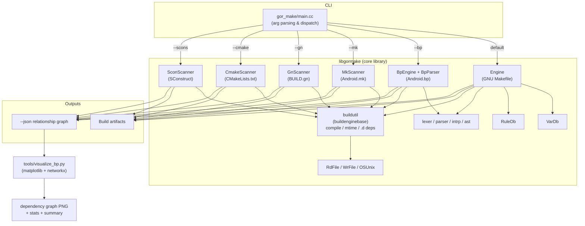

# GORMAKE (`gor_make`)

A single, `make`-compatible build driver that understands **six** different
build-description formats. Point it at a project and it will scan the build
file, resolve module/target relationships, and either build the project or emit
a JSON relationship graph you can visualize.

Supported formats:

| Format        | Default file       | Flag       |
| ------------- | ------------------ | ---------- |
| GNU Makefile  | `Makefile`         | *(default)* |
| Android.bp (Blueprint) | `Android.bp`   | `--bp`   |
| Android.mk    | `Android.mk`       | `--mk`     |
| GN            | `BUILD.gn`         | `--gn`     |
| CMake         | `CMakeLists.txt`   | `--cmake`  |
| SCons         | `SConstruct` / `SConscript` | `--scons` |

---

## Requirements

- **Bazel** (uses Bzlmod / `MODULE.bazel`; any modern Bazel 7+/Bazelisk works)
- A C++17 toolchain (GCC or Clang)
- *(Optional, for graph rendering)* Python 3 with `matplotlib` and `networkx`

---

## Build

```bash
# Build everything (library, binary, tests)
bazel build //...

# Build just the CLI
bazel build //gor_make:gor_make
```

The resulting binary lands at `bazel-bin/gor_make/gor_make`.

---

## Test

The project ships a self-contained scanner test suite (12 cases covering all
six formats plus their JSON output). No external test framework needed.

```bash
# Run the test suite
bazel test //libgormake:scanner_test

# See full output (per-format pass/fail + sample JSON)
bazel test //libgormake:scanner_test --test_output=all
```

Expected tail of output:

```
  Results: 12 passed, 0 failed
```

---

## Run

Run the binary directly (or via `bazel run //gor_make:gor_make -- ...`).

```bash
BIN=bazel-bin/gor_make/gor_make

# GNU Makefile mode (default) — build target(s)
$BIN -f Makefile all

# Android.bp
$BIN --bp                       # uses ./Android.bp
$BIN --bp-file=path/Android.bp

# Android.mk
$BIN --mk                       # uses ./Android.mk
$BIN --mk-file some/Android.mk
$BIN --mk-dir  some/dir

# GN
$BIN --gn                       # uses ./BUILD.gn

# CMake
$BIN --cmake                    # uses ./CMakeLists.txt

# SCons
$BIN --scons                    # uses ./SConstruct or ./SConscript
```

Handy global flags (GNU-make compatible where it makes sense):

| Flag                | Meaning                                              |
| ------------------- | ---------------------------------------------------- |
| `-n`, `--dry-run`   | Print commands, don't execute                        |
| `-j [N]`, `--jobs`  | Parallel jobs (no arg = unlimited)                   |
| `--clean`           | Remove build outputs                                 |
| `-v`, `--verbose`   | Show every command                                   |
| `--json`            | Emit the relationship graph as JSON (no build)       |
| `-C DIR`            | Change to `DIR` first                                |
| `-h`, `--version`   | Help / version                                       |

### Try the bundled demos

Each folder under `demos/` is a tiny "calculator" project in one format:

```bash
BIN=$(pwd)/bazel-bin/gor_make/gor_make

cd demos/android_bp && $BIN --bp            # build it
cd demos/cmake      && $BIN --cmake --json  # inspect relationships
cd demos/build_gn   && $BIN --gn -n         # dry-run
```

---

## Visualize the relationship graph

`gor_make --json` prints a normalized description of every module/target and
its dependencies. Feed that to the bundled tool to render graphs:

```bash
BIN=bazel-bin/gor_make/gor_make

# 1. Emit JSON for any format
cd demos/android_bp
$BIN --bp --json > bp.json

# 2. Render dependency graph + stats + text summary
python3 ../../tools/visualize_bp.py bp.json myproject
# → myproject_dependency_graph.png
# → myproject_stats.png
# → myproject_summary.txt
```

The same tool works for every format (`--gn --json`, `--cmake --json`,
`--scons --json`, `--mk --json`, and the default Makefile `--json`).

---

## Architecture & relationship graph

`gor_make` is one CLI front-end dispatching to one scanner/engine per format.
All scanners share the same file-scan → relationship-model → build/JSON
pipeline via `buildutil` helpers.



### Source layout

| Path                        | Role                                             |
| --------------------------- | ------------------------------------------------ |
| `gor_make/main.cc`          | CLI: argument parsing and dispatch to a scanner  |
| `libgormake/engine.*`       | GNU Makefile parse + build engine                |
| `libgormake/bp_engine.*`, `bp_parser.*` | Android.bp (Blueprint) engine/parser |
| `libgormake/mk_scanner.*`   | Android.mk scanner                               |
| `libgormake/gn_scanner.*`   | GN (`BUILD.gn`) scanner                          |
| `libgormake/cmake_scanner.*` | CMake scanner                                   |
| `libgormake/scons_scanner.*` | SCons scanner                                   |
| `libgormake/build_engine_base.*` | Shared build utilities (compile, mtime, `.d`) |
| `libgormake/var_db.*`, `rule_db.*` | Variable and rule databases               |
| `libgormake/lexer.*`, `parser.*`, `intrp.*`, `ast.h` | Tokenizing / parsing / interpretation |
| `libgormake/rd_file.*`, `wr_file.*`, `os_unix.cc` | File & OS I/O helpers          |
| `libgormake/scanner_test.cc` | Test suite for all scanners                     |
| `tools/visualize_bp.py`     | Render JSON relationship graph to PNG            |
| `demos/`                    | One sample project per supported format          |

---

## License

Apache License 2.0. Copyright (c) 2015 GORMAKE project — Merck Hung
`<merckhung@gmail.com>`.
